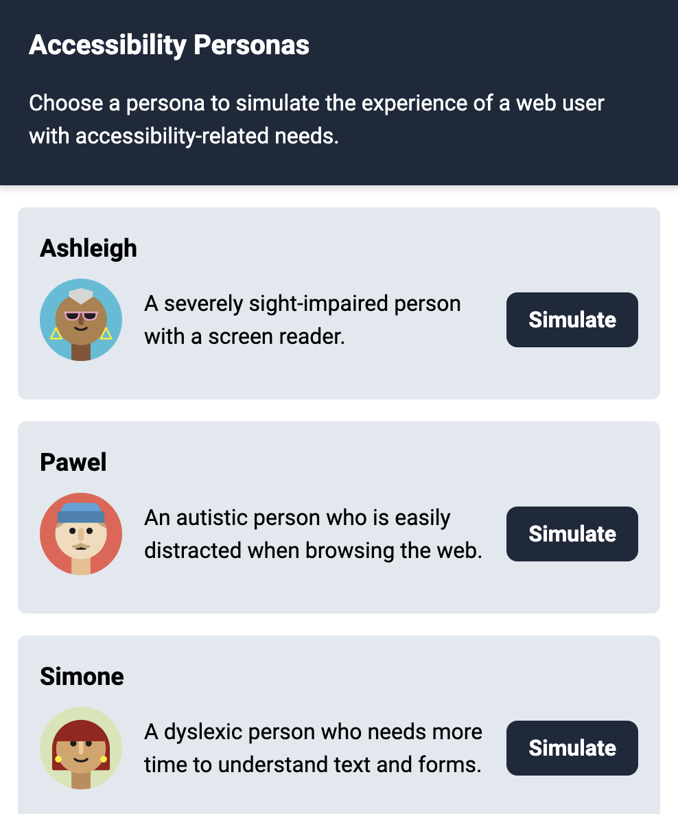

# Simulating accessibility personas

Chrome extension for simulating the [accessibility personas](https://github.com/alphagov/accessibility-personas) that were created by the UK Government Digital Service (GDS) and adapted by Germany's [DigitalService GmbH des Bundes](https://digitalservice.bund.de/). This is a work in progress. Feedback and contributions are welcome.

The extension simulates various impairments (e.g, low vision, dyslexia) by injecting CSS and JS files to the currently active tab. Most CSS and JS files were taken directly from the GDS repo, some were slightly modified.

## Usage

Select a persona from the extension and the current browser tab will be adjusted to simulate the persona's experience.

For some personas, you will need to install additional extensions at this point, or change your system settings (e.g., activate VoiceOver on your Mac). This is mentioned in the additional instructions for each persona.

## Installation

1. Download this repository as a ZIP file. Unzip it.

2. Open Google Chrome and navigate to `chrome://extensions/`.

3. Activate "Developer mode" in the top-right corner.

4. Select "Load unpacked" and select the folder you downloaded from here.

5. Pin the extension (📍) to keep it visible.
