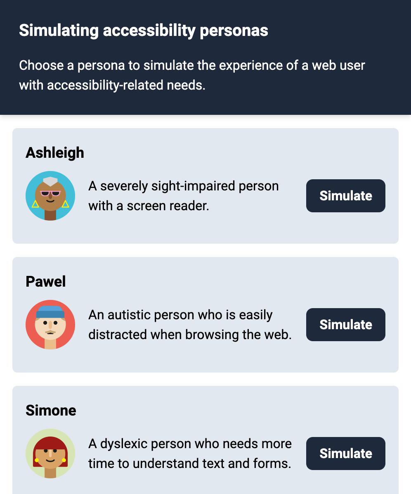

# Simulating accessibility personas
Chrome extension for simulating the [accessibility personas](https://github.com/alphagov/accessibility-personas) that were created by the UK Government Digital Service (GDS) and adapted by the German DigitalService. The is a work in progress and feedback is welcome!

Various impairments (e.g, low vision, dyslexia) are simulated by injecting CSS and JS to change the appearance and behavior of websites in the currently active tab. The CSS and JS files were obtained directly from the GDS repo.

## Usage
Select a persona from the extension and the current browser tab will be adjusted to simulate the persona's experience.

For some personas, you will need to install additional extensions at this point, or change your system settings (e.g., activate VoiceOver on your Mac). This is mentioned in the additional instructions for each persona.

## Installation

1. Download this repository as a ZIP file. Unzip it.

2. Open Google Chrome and navigate to `chrome://extensions/`.

3. Activate "Developer mode" in the top-right corner.

4. Select "Load unpacked" and select the folder you downloaded from here.

5. Pin the extension to keep it visible. 

